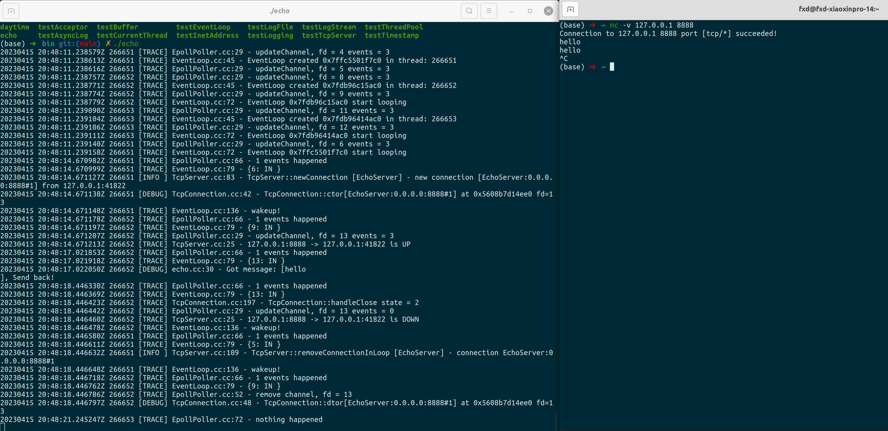

### CppNet

CppNet 一个小型的 C++ 网络库，大部分代码参考陈硕的 muduo 网络库，用于学习基于 Reactor 模型的多线程 Linux 网络服务器的设计。  

项目使用 C++ 11 编写，保留了 muduo 库中最核心的部分，使用 lambda 表达式代替了原来的 std::bind 的回调写法，要求 C++ 14 以上(使用了 lambda 广义捕获和 make_unique)。  

特点如下：

1. 使用 Epoll(LT 模式) 或 Poll 结合非阻塞 IO 实现的 Reactor 模型。
2. 使用 Linux 下的 timerfd 实现定时器功能，便于将定时器到期事件加入 IO 多路复用中统一管理。定时器管理使用红黑树(采用 STL 库中的 set 容器)。
3. 使用 eventfd 代替传统的 pipe 方式实现事件循环的唤醒。
4. One loop per thread, 由主线程负责监听并接受连接，通过 round-robin 的方式派发至 IO 线程处理，IO 线程通过线程池进行管理。
5. 异步日志系统设计，分为日志前端(生产者)和后端(消费者)，前端负责生成日志，后端负责将日志写入磁盘，避免磁盘 IO 对服务能力的影响。
6. 采用 C++ 11 编写，删除了很多原 muduo 库的手动造的轮子，如使用 std::thread, std::condition_variable, std::mutex 等。此外，资源管理统一使用智能指针，避免裸指针带来的内存管理困难问题。

### 开发环境

* 操作系统：Ubuntu 20.04 LTS, 
* linux kernel 版本: 5.15.0  
* 编译器：g++ 9.4.0  
* CMake 版本：3.22
* IDE: Jetbrains-CLion 教育版

此外，有部分单元测试采用 GTest 框架编写，需要安装 GTest 套件。

### 构建项目

先安装 GTest 单元测试框架：[https://github.com/google/googletest](https://github.com/google/googletest).

获取本项目：  

```shell
git clone git@github.com:xiaoqieF/CppNet.git
```

进入项目编译：  

```shell
cd CppNet
mkdir build
cd build && cmake ..
make
```

### 例子

简单的 Echo 服务：  

```c++
#include "net/TcpServer.h"
#include "net/EventLoop.h"
#include "net/TcpConnection.h"
#include "logger/Logging.h"

using namespace CppNet;

class EchoServer : noncopyable {
public:
    EchoServer(EventLoop* loop, const InetAddress& listenAddr)
            : loop_(loop),
              server_(loop, listenAddr, "EchoServer") {
        server_.setThreadNum(2);
        server_.setMessageCallback([](const TcpConnectionPtr& conn, Buffer* buf, Timestamp now) {
            onMessage(conn, buf, now);
        });
    }
    ~EchoServer() = default;
    void start() { server_.start(); }
private:
    static void onMessage(const TcpConnectionPtr& conn, Buffer* buf, Timestamp now) {
        auto message = buf->retrieveAllAsString();
        LOG_DEBUG << "Got message: [" << message << "], Send back!";
        conn->send(message);
    }
    EventLoop* loop_;
    TcpServer server_;
};

int main() {
    Logger::setLogLevel(Logger::TRACE);
    EventLoop loop;

    EchoServer server(&loop, InetAddress(8888));
    server.start();

    loop.loop();
}
```

运行截图：  

  

### 参考
1. [https://github.com/chenshuo/muduo](https://github.com/chenshuo/muduo)   
2. 《Linux多线程服务端编程》
